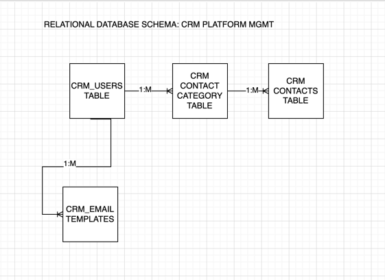
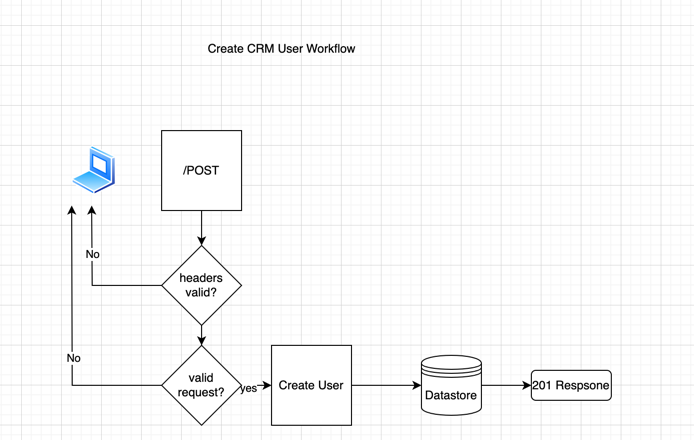
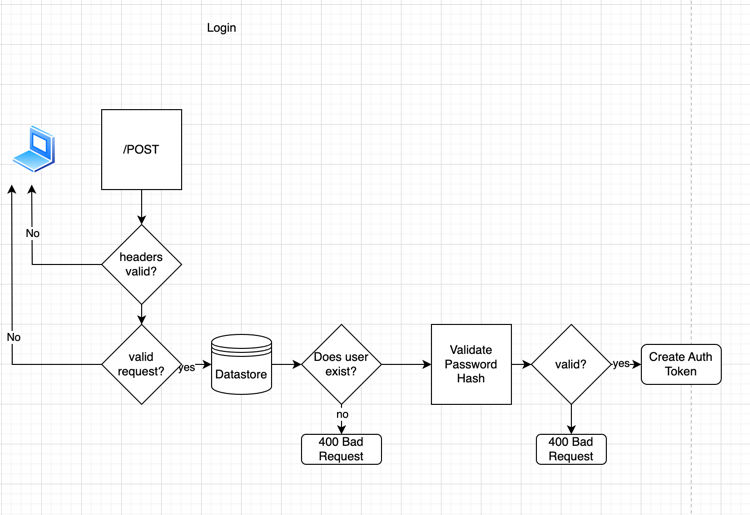
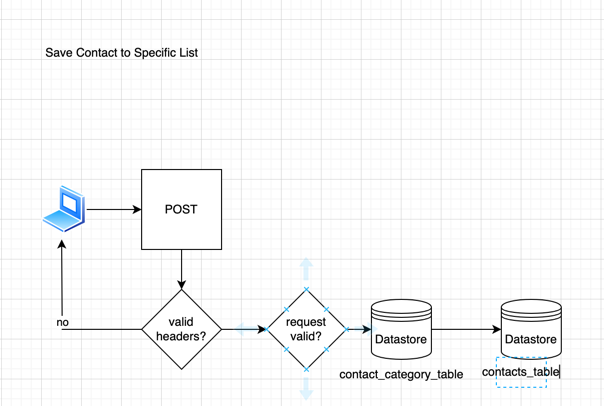
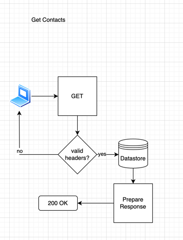
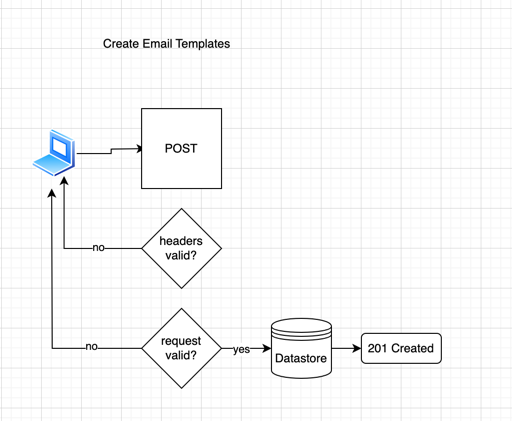

<h3> CRM Platform Management API </h3>

This API is to integrate with CRM Platforms

Prereqs:

- install Postgres App for datastore use of the API

- https://postgresapp.com/downloads.html

- Run the scripts to create the database & tables here:

- scripts/crm_table_schema.sql


DATABASE SCHEMA



<br> <br>

To run the API Localy

```

make start-api

```

To run unit tests

```

make run-tests

```


API Endpoints:

<h3> POST /crm-platform-management-api/create-user </h3>

Workflow



Example Request

```

curl --location 'https://localhost:8080/crm-platform-management-api/create-user' \
--header 'Accept: application/json' \
--header 'Content-Type: application/json' \
--header 'Client-Id: CRM-ADMIN' \
--data-raw '{
"username":"javar",
"password":"temp123!@#"
}'

```

Example Response


```

201 Created

```


<br><br>

<h4> POST /crm-platform-management-api/auth/login </h4>

Workflow



Example Request

```

curl --location 'https://localhost:8080/crm-platform-management-api/auth/login' \
--header 'Accept: application/json' \
--header 'Content-Type: application/json' \
--header 'Client-Id: CRM-ADMIN' \
--data-raw '{
"username":"javar",
"password":"temp123!@#"
}'

```

Example Response

```

{
"token": "test-token"

}

```

<br> <br>

<h4> POST /crm-platform-management-api/{user_id}/contacts </h4>

Workflow



Example Request

```

curl --location 'https://localhost:8080/crm-platform-management-api/1e305377-0fd7-4985-9ebc-d97733e6f71f/contacts' \
--header 'Accept: application/json' \
--header 'Content-Type: application/json' \
--header 'Client-Id: CRM-ADMIN' \
--data-raw '{
"name": "Javar Harris",
"phone":"804-455-1234",
"email":"jharris@gmail.com",
"contact_type":"Javar List"
}'

```

Example Response

```

{
"success:true, "message":"contact created"

}

```

<br> <br>

<h3> GET /crm-platform-management-api/{user_id}/contacts</h3>


Example Request

```

curl --location --request GET 'https://localhost:8080/crm-platform-management-api/1e305377-0fd7-4985-9ebc-d97733e6f71f/contacts' \
--header 'Accept: application/json' \
--header 'Content-Type: application/json' \
--header 'Client-Id: CRM-ADMIN' \
--data-raw '{
"name": "Javante Harris",
"phone":"804-455-1234",
"email":"jharris@gmail.com",
"contact_type":"test"
}'


```

Example Response

```

[
{
"name": "Javar Harris",
"phone": "804-555-1234",
"email": "javarharris@gmail.com"
},
{
"name": "Javar Harris",
"phone": "804-555-1234",
"email": "javarharris@gmail.com"
},
{
"name": "Javar Harris",
"phone": "804-555-1234",
"email": "javarharris@gmail.com"
},
{
"name": "Jalen Harris",
"phone": "804-555-1234",
"email": "javarharris@gmail.com"
},
{
"name": "Javante Harris",
"phone": "804-455-1234",
"email": "jharris@gmail.com"
},
{
"name": "Javante Harris",
"phone": "804-455-1234",
"email": "jharris@gmail.com"
},
{
"name": "Javar Harris",
"phone": "804-455-1234",
"email": "jharris@gmail.com"
}
]


<br> <br>

```

<h3> GET /crm-platform-management-api/{user_id}/contacts?category={category_id} </h3>

Workflow



Example Request

```

curl --location --request GET 'https://localhost:8080/crm-platform-management-api/1e305377-0fd7-4985-9ebc-d97733e6f71f/contacts?category_id=12c6f814-a7ff-4c4f-a769-bae422920e52' \
--header 'Accept: application/json' \
--header 'Content-Type: application/json' \
--header 'Client-Id: CRM-ADMIN' \
--data-raw '{
"name": "Javante Harris",
"phone":"804-455-1234",
"email":"jharris@gmail.com",
"contact_type":"test"
}'


```


Example Response


```

[
{
"name": "Jalen Harris",
"phone": "804-555-1234",
"email": "javarharris@gmail.com"
},
{
"name": "Javante Harris",
"phone": "804-455-1234",
"email": "jharris@gmail.com"
}
]


```

<h3> /crm-platform-management-api/{user_id}/email/email-templates </h3>

Workflow



Example Request

```

curl --location 'https://localhost:8080/crm-platform-management-api/1e305377-0fd7-4985-9ebc-d97733e6f71f/email/email-templates' \
--header 'Accept: application/json' \
--header 'Content-Type: application/json' \
--header 'Client-Id: CRM-ADMIN' \
--data '{
    "template_name": "greeting_email_template",
    "subject": "Follow up - {name}",
    "body": "Hello {name}, \n Thank you for contacting us at {company_name}. We have obtained your request and will contact you shorty."
}'


```

Example Response

```

{
    "success": true,
    "message": "email template created for user"
}

```